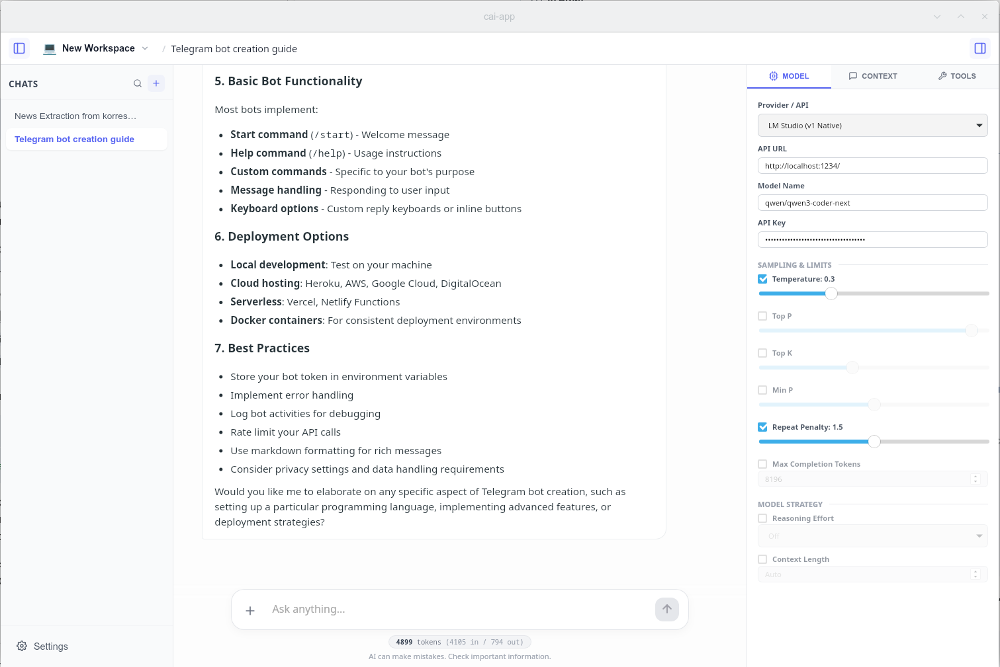
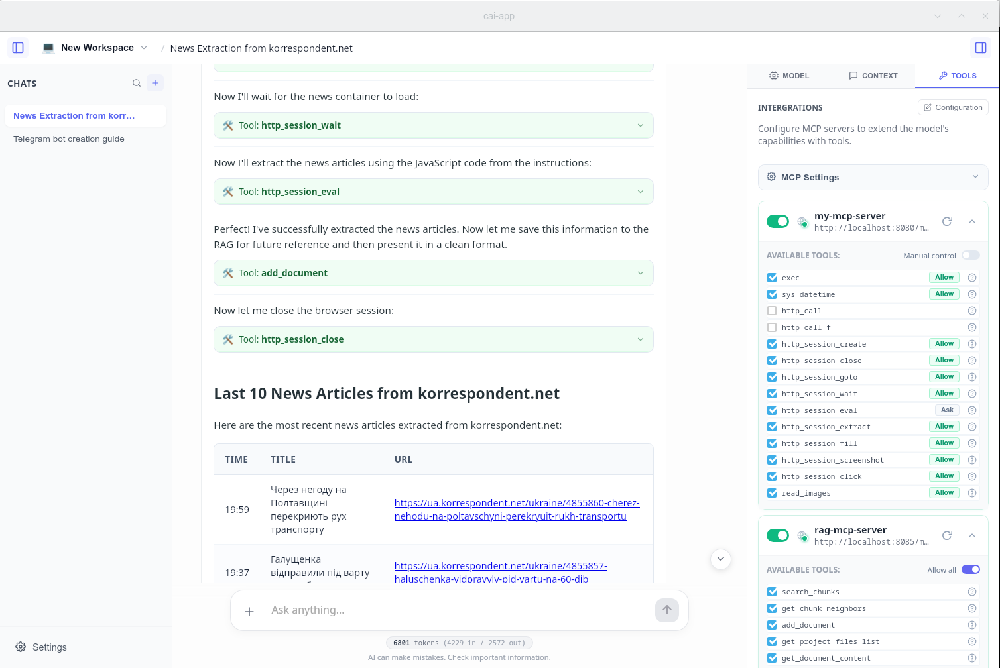
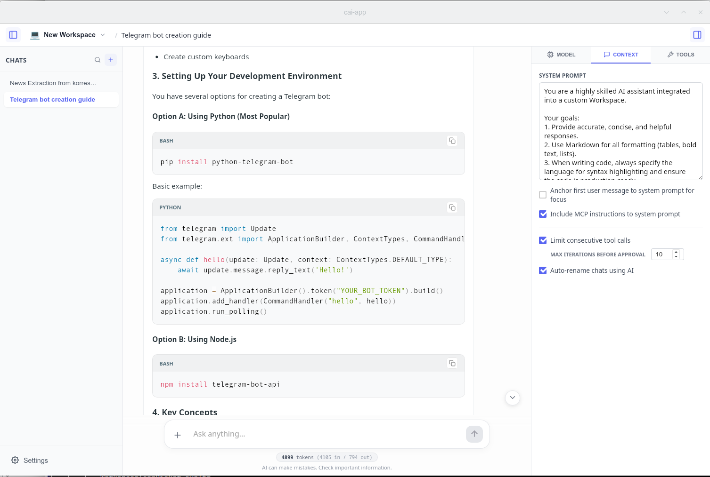

# CAI App

**CAI App** is a lightweight, high-performance desktop AI client built with **Tauri 2** and **Svelte 5**. Designed for power users, it focuses on task-oriented workflows, seamless remote API integration, and unrestricted tool use via the Model Context Protocol (MCP).

## ✨ Key Features

### 📂 Workspace-First Architecture
CAI App introduces a structured approach to AI interactions through **Workspaces**:
- **Workspaces**: Dedicated environments configured for specific task types. Each workspace stores its own API settings, model parameters (temperature, top-p, seed, etc.), system prompts, and a selection of **MCP Servers**.
- **Chats**: Contextual task instances that live within a Workspace, inheriting all its configurations for a consistent experience.



### 🛠 Unrestricted MCP Integration
Built specifically for deep integration with the **Model Context Protocol (MCP)**:
- **No Response Truncation**: Unlike many other clients that cap tool outputs at ~50KB, CAI App allows for unlimited data transfer. This is essential for analyzing large codebases, logs, or datasets via MCP tools.
- **Visual Tool Widgets**: Real-time feedback for tool execution, approvals, and data retrieval.



### 🌐 API-Centric Design
CAI App is optimized for connecting to remote or local inference servers via HTTP API:
- **LM Studio**: Native support for the `api/v1/chat` protocol.
- **OpenAI Compatible**: Full support for standard `/v1/chat/completions` endpoints.
- **OpenRouter**: Tailored integration for OpenRouter’s specific OpenAI-compliant implementation.

### 🧠 Modern UI/UX
- **Reasoning Support**: Distinct rendering for "Chain of Thought" models (like DeepSeek R1 or OpenAI o1), making complex logic easy to follow.
- **Workspace Settings Panel**: A powerful sidebar to manage Workspace context, monitor MCP server health, and tune parameters on the fly.
- **Multilingual**: Fully localized into **4 languages** via Paraglide-js.



---

## 🖋 Author's Note

This is my first venture into desktop application development. **CAI App** was born out of a personal need for a more flexible AI client that doesn't limit tool interactions. 

The project was developed with intensive use of AI assistants, showcasing how modern tools can empower a single developer to build complex, cross-platform software from scratch. While it may have some first-timer quirks, it is built with passion and a focus on solving real-world workflow constraints.

---

## 🛠 Tech Stack

- **Frontend**: [Svelte 5](https://svelte.dev/) (using Runes for reactive performance)
- **Desktop Core**: [Tauri 2](https://tauri.app/) (Rust)
- **Localization**: [Paraglide-js](https://inlang.com/)
- **Markdown**: [Marked](https://marked.js.org/) + [PrismJS](https://prismjs.com/) for syntax highlighting

## 📥 Installation & Download

### Ready-to-Use Binaries
You can find the latest installers for your OS in the [Releases](https://github.com/serge2/cai-app/releases) section.
- **Linux**: Available as **AppImage** (portable) and **.deb** package.
- **Windows**: Standard **.exe** installer (NSIS).
- **macOS**: **.dmg** disk image for Apple Silicon and Intel.

### Building from Source
1. **Prerequisites**: [Rust](https://www.rust-lang.org/tools/install) and [Node.js](https://nodejs.org/) (v20+).
2. **Clone & Install**:
   ```bash
   git clone [https://github.com/serge2/cai-app.git](https://github.com/serge2/cai-app.git)
   cd cai-app
   npm install

    Run Dev Mode:
    Bash

    npm run tauri dev

## 📦 Production Build & Artifacts

To create an optimized production bundle for your current OS, run:
Bash

npm run tauri build

Once the build is complete, you can find the installer artifacts in the following directory:

    Path: src-tauri/target/release/bundle/

Depending on your OS, look into the specific subfolders (e.g., appimage/ or nsis/) for the final .AppImage or .exe files.

## 📜 Credits & Legal
Third-Party Libraries

    Tauri — Desktop GUI framework (MIT/Apache 2.0)

    Svelte — Frontend framework (MIT)

    MCP SDK — Tool integration (MIT)

    Paraglide-js — i18n support (Apache 2.0)

### Icons

    UI Icons: Custom generated and optimized for the CAI App interface.

    Technology logos (Tauri, Svelte, etc.) are trademarks of their respective owners.

# Disclaimer

CAI App is a client-side interface. It does not provide LLMs. You must connect it to an external server (Local LM Studio, OpenAI, etc.) via HTTP API.

# 📄 License

This project is licensed under the MIT License. See the LICENSE file for details.

Copyright (c) 2026 Sergii Polkovnikov
